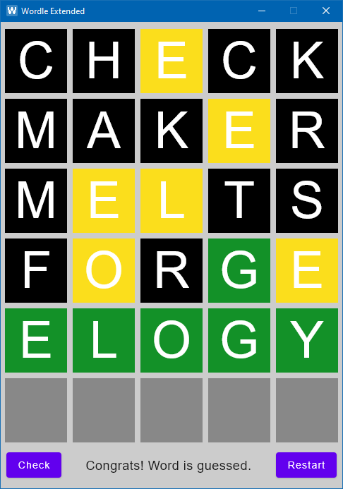

This is a **Wordle** game, built on Kotlin and packed by Compose Desktop. Source game can be found [here](https://www.powerlanguage.co.uk/wordle/).

The goal of game is to guess the word which is randomly selected from 100k+ words dictionary. You have 6 attempts. After entering letters in the boxes and proceeding click of `Check` button (or just hit `Enter` key), game will highlight each letter with a specific color:
- Green - letter is in its right place;
- Yellow - letter is in word, but place is still wrong;
- Black - letter is not presented in word.

The main reason of making this game and not just playing original is the fact, that original game has one word for you to guess each 24 hours.
